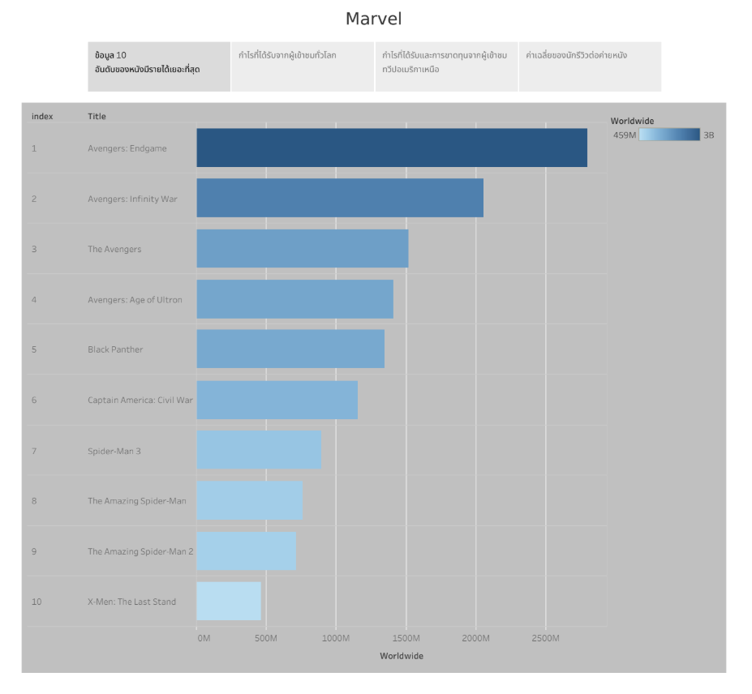
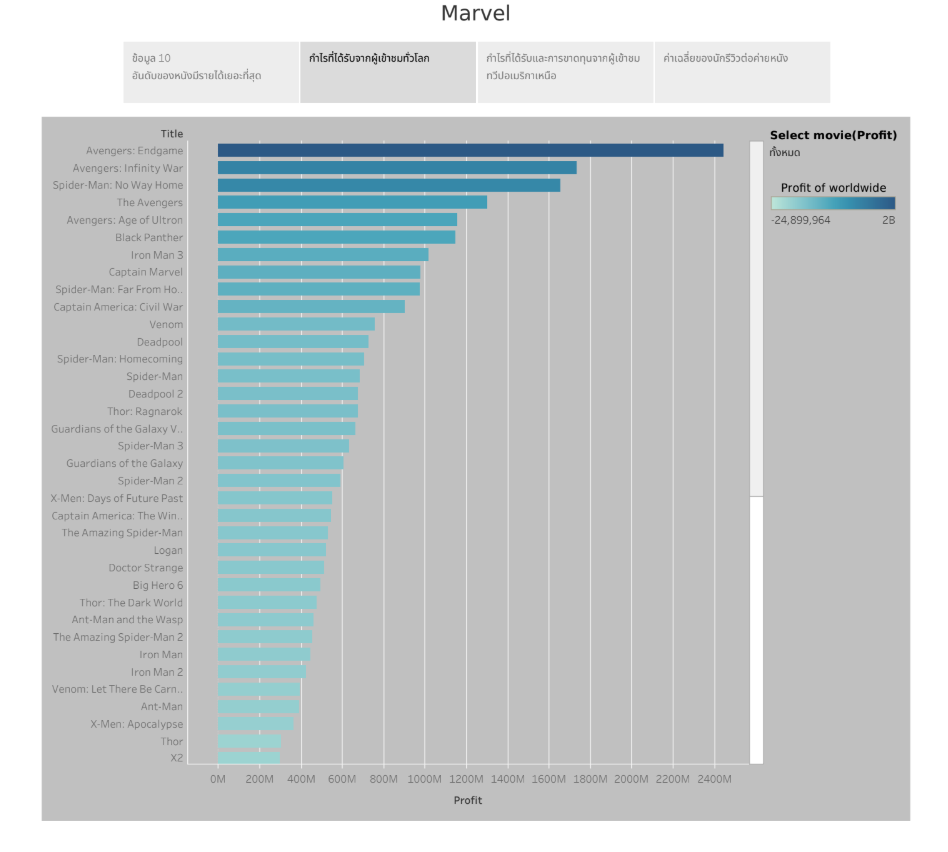
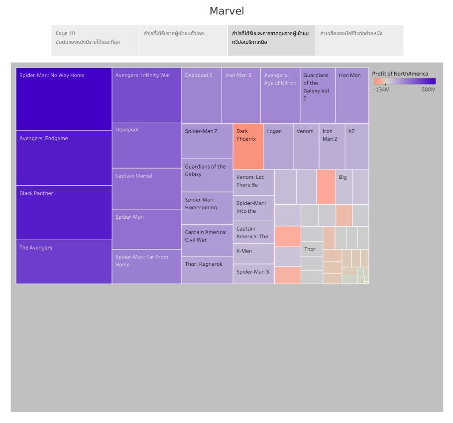
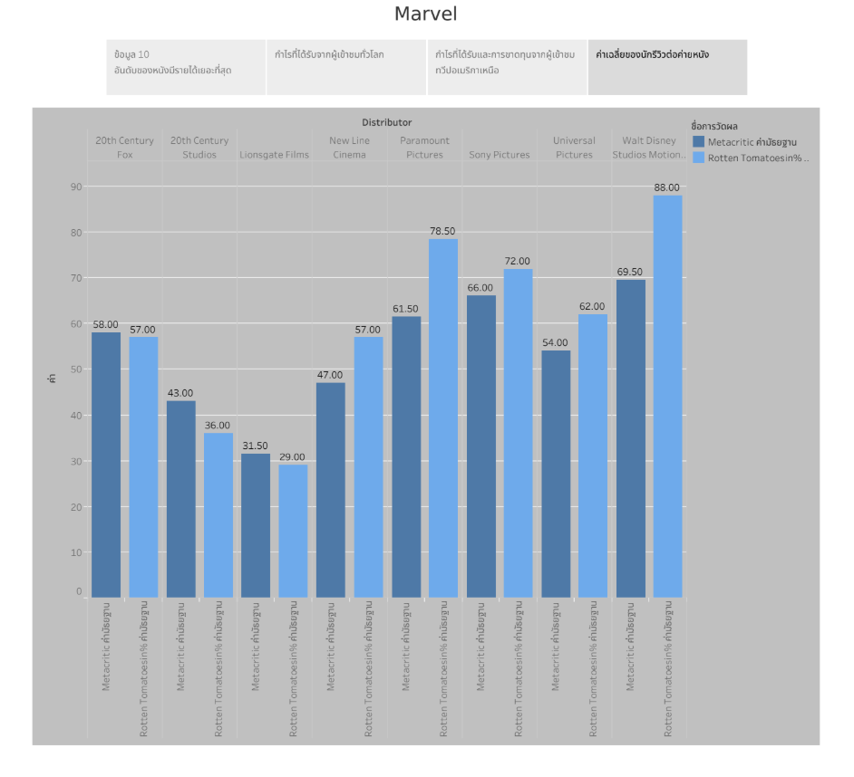

# Dashboard

**Dashboard ที่แสดงข้อมูลเกี่ยวกับภาพยนต์มาเวล(Marvel) โดยแสดงรายได้ บริษัทร่วมจัดจำหน่าย และงบประมาณของภาพยนต์แต่ละเรื่อง**
- **รายได้:**
  - แสดงรายได้เปิดตัวภาพยนต์ในสัปดาห์แรกจากอเมริกาเหนือ
  - แสดงรายได้จากพื้นที่อื่นๆ
  - แสดงรายได้รวมจากทั่วโลก
  - แสดงรายได้จากอเมริกาเหนือ
 
- **บริษัทที่จัดจำหน่ายภาพยนต์:**
  - แสดงชื่อบริษัทที่จัดหน่ายภาพยนต์มากที่สุด

- **งบประมาณของภาพยนต์แต่ละเรื่อง:**
  - แสดงงบประมาณที่ใช้สร้างภาพยนตร์แต่ละเรื่อง

[ข้อมูลที่นำมาทำ Dashboard](https://www.kaggle.com/datasets/minisam/marvel-movie-dataset?resource=download&select=marvel_clean.csv) 
[**Click to access the Dashboard**](https://public.tableau.com/views/Dashboard_Mavel/Dashboard?:language=en-US&:sid=&:redirect=auth&:display_count=n&:origin=viz_share_link)

# Story
**แสดงถึงความสำเร็จของภาพยนต์มาเวล(Marvel) ตั้งแต่รายได้ กำไรในตลาดต่าง ๆ รวมถึงการตอบรับจากผู้วิจารณ์และผู้ชม**

**Story 1**
  - แสดงข้อมูล10อันดับของภาพยนต์ที่มีรายได้มากที่สุด

**Story 2**
  - แสดงกำไรที่ได้รับจากผู้ชมทั่วโลกของภาพยนต์แต่ละเรื่อง

**Story 3**
  - แสดงกำไรที่ได้รับและการขาดทุนจากผู้เข้าชมทวีปอเมริกาเหนือ

**Story 4**
  - แสดงค่าเฉลี่ยของนักรีวิวต่อบริษัทที่จัดจำหน่ายภาพยนต์

[Click to view the details of the Story](https://public.tableau.com/shared/Y3MRT4DPR?:display_count=n&:origin=viz_share_link)
